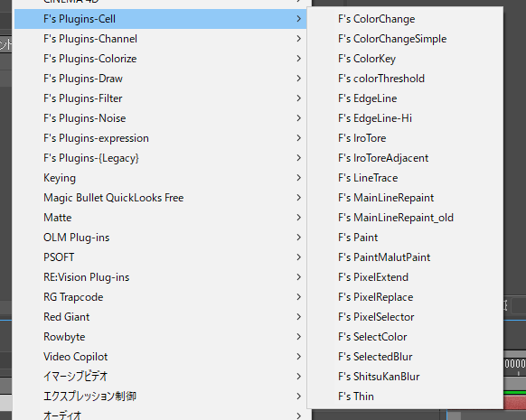
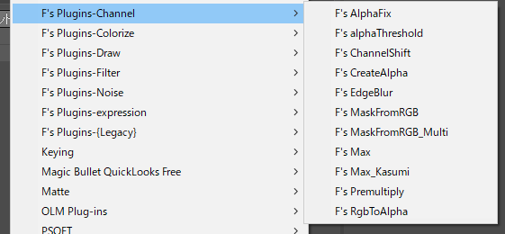
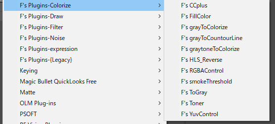
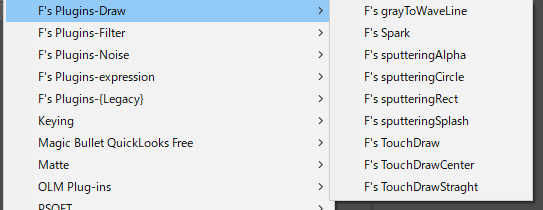
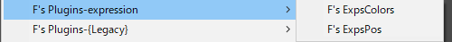
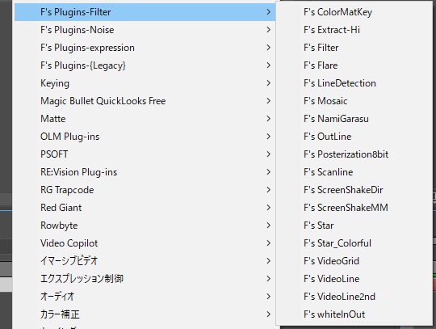
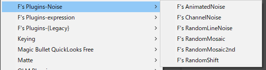
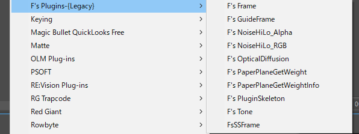

# F's Plugins リファレンス

<!-- @import "[TOC]" {cmd="toc" depthFrom=1 depthTo=6 orderedList=false} -->

<!-- code_chunk_output -->

- [F's Plugins リファレンス](#fs-plugins-リファレンス)
  - [F's Pluginsとは](#fs-pluginsとは)
  - [開発環境](#開発環境)
  - [動作環境](#動作環境)
  - [Cellカテゴリ](#cellカテゴリ)
    - [F's ColorChange.aex](#fs-colorchangeaex)
    - [F's ColorChangeSimple.aex](#fs-colorchangesimpleaex)
    - [F's ColorKey.aex](#fs-colorkeyaex)
    - [F's colorThreshold.aex](#fs-colorthresholdaex)
    - [F's EdgeLine.aex](#fs-edgelineaex)
    - [F's EdgeLine-Hi.aex](#fs-edgeline-hiaex)
    - [F's IroTore.aex](#fs-irotoreaex)
    - [F's IroToreAdjacent.aex](#fs-irotoreadjacentaex)
    - [F's LineTrace.aex](#fs-linetraceaex)
    - [F's MainLineRepaint.aex](#fs-mainlinerepaintaex)
    - [F's MainLineRepaint_old.aex](#fs-mainlinerepaint_oldaex)
    - [F's Paint.aex](#fs-paintaex)
    - [F's PaintMultPoint.aex](#fs-paintmultpointaex)
    - [F's PixelExtend.aex](#fs-pixelextendaex)
    - [F's PixelReplace.aex](#fs-pixelreplaceaex)
    - [F's PixelSelector.aex](#fs-pixelselectoraex)
    - [F's SelectColor.aex](#fs-selectcoloraex)
    - [F's SelectedBlur.aex](#fs-selectedbluraex)
    - [F's ShitsuKanBlur.aex](#fs-shitsukanbluraex)
    - [F's Thin.aex](#fs-thinaex)
  - [Channelカテゴリ](#channelカテゴリ)
    - [F's AlphaFix.aex](#fs-alphafixaex)
    - [F's alphaThreshold.aex](#fs-alphathresholdaex)
    - [F's ChannelShift.aex](#fs-channelshiftaex)
    - [F's CreateAlpha.aex](#fs-createalphaaex)
    - [F's EdgeBlur.aex](#fs-edgebluraex)
    - [F's MaskFromRGB.aex](#fs-maskfromrgbaex)
    - [F's MaskFromRGB_Multi.aex](#fs-maskfromrgb_multiaex)
    - [F's Max.aex](#fs-maxaex)
    - [F's Max_Kasumi.aex](#fs-max_kasumiaex)
    - [F's Premultiply.aex](#fs-premultiplyaex)
    - [F's RgbToAlpha.aex](#fs-rgbtoalphaaex)
  - [Colorizeカテゴリ](#colorizeカテゴリ)
    - [F's CCplus.aex](#fs-ccplusaex)
    - [F's FillColor.aex](#fs-fillcoloraex)
    - [F's grayToCountourLine.aex](#fs-graytocountourlineaex)
    - [F's grayToColorize.aex](#fs-graytocolorizeaex)
    - [F's graytoneToColorize.aex](#fs-graytonetocolorizeaex)
    - [F's HLS_Reverse.aex](#fs-hls_reverseaex)
    - [F's RGBAControl.aex](#fs-rgbacontrolaex)
    - [F's smokeThreshold.aex](#fs-smokethresholdaex)
    - [F's ToGray.aex](#fs-tograyaex)
    - [F's Toner.aex](#fs-toneraex)
    - [F's YuvControl.aex](#fs-yuvcontrolaex)
  - [Drawカテゴリ](#drawカテゴリ)
    - [F's grayToWaveLine.aex](#fs-graytowavelineaex)
    - [F's Spark.aex](#fs-sparkaex)
    - [F's sputteringAlpha.aex](#fs-sputteringalphaaex)
    - [F's sputteringCircle.aex](#fs-sputteringcircleaex)
    - [F's sputteringRect.aex](#fs-sputteringrectaex)
    - [F's sputteringSplash.aex](#fs-sputteringsplashaex)
    - [F's TouchDraw.aex](#fs-touchdrawaex)
    - [F's TouchDrawCenter.aex](#fs-touchdrawcenteraex)
    - [F's TouchDrawStraght.aex](#fs-touchdrawstraghtaex)
  - [expressionカテゴリ](#expressionカテゴリ)
    - [F's ExpsColors.aex](#fs-expscolorsaex)
    - [F's ExpsPos.aex](#fs-expsposaex)
  - [Filterカテゴリ](#filterカテゴリ)
    - [F's ColorMatKey.aex](#fs-colormatkeyaex)
    - [F's Extract-Hi.aex](#fs-extract-hiaex)
    - [F's Filter.aex](#fs-filteraex)
    - [F's Flare.aex](#fs-flareaex)
    - [F's LineDetection.aex](#fs-linedetectionaex)
    - [F's Mosaic.aex](#fs-mosaicaex)
    - [F's NamiGarasu.aex](#fs-namigarasuaex)
    - [F's OutLine.aex](#fs-outlineaex)
    - [F's Posterization8bit.aex](#fs-posterization8bitaex)
    - [F's Scanline.aex](#fs-scanlineaex)
    - [F's ScreenShakeDir.aex](#fs-screenshakediraex)
    - [F's ScreenShakeMM.aex](#fs-screenshakemmaex)
    - [F's Star.aex](#fs-staraex)
    - [F's Star_Colorful.aex](#fs-star_colorfulaex)
    - [F's VideoGrid.aex](#fs-videogridaex)
    - [F's VideoLine.aex](#fs-videolineaex)
    - [F's VideoLine2nd.aex](#fs-videoline2ndaex)
    - [F's whiteInOut.aex](#fs-whiteinoutaex)
  - [Noiseカテゴリ](#noiseカテゴリ)
    - [F's AnimatedNoise.aex](#fs-animatednoiseaex)
    - [F's ChannelNoise.aex](#fs-channelnoiseaex)
    - [F's RandomLineNoise.aex](#fs-randomlinenoiseaex)
    - [F's RandomMosaic.aex](#fs-randommosaicaex)
    - [F's RandomMosaic2nd.aex](#fs-randommosaic2ndaex)
    - [F's RandomShift.aex](#fs-randomshiftaex)
  - [{Legacy}カテゴリ](#legacyカテゴリ)
    - [F's Frame.aex](#fs-frameaex)
    - [F's GuideFrame.aex](#fs-guideframeaex)
    - [F's NoiseHiLo_Alpha.aex](#fs-noisehilo_alphaaex)
    - [F's NoiseHiLo_RGB.aex](#fs-noisehilo_rgbaex)
    - [F's OpticalDiffusion.aex](#fs-opticaldiffusionaex)
    - [F's PaperPlaneGetWeight.aex](#fs-paperplanegetweightaex)
    - [F's PaperPlaneGetWeightInfo.aex](#fs-paperplanegetweightinfoaex)
    - [F's PluginSkeleton.aex](#fs-pluginskeletonaex)
    - [F's Tone.aex](#fs-toneaex)
    - [F's FsSSFrame.aex](#fs-fsssframeaex)
- [作った人](#作った人)

<!-- /code_chunk_output -->

## F's Pluginsとは
**Adobe after effects**用のエフェクトプラグイン集です。
僕(by-ful)が趣味で開発して使っていたものですが、おかげさまで多くの人に使ってもらってます。

特徴として

1. **無料** 僕が仕事で使った段階でペイされたと解釈しているので、その後使う分には料金は発生しないという理由です。もともとお金がなくてプラグイン買えなくて作り始めたので、これでお金儲ける気は全くないです。

2. **そんな大したことはできない** ソースを見てもらえばわかりますが、SDKをちょっと改造したものばかりです。流石に20年も続けて作っているのでごくたまに凄いものもありますが、まぁ趣味レベルです。
3. **使用条件が限りなく低い** 一応面倒なのでMITライセンスとしていますが、昔のPC98時代にあった**MAG**フォーマット関係の**フリーソフト**と同じ扱いです。P関係のようにライセンスの厳しいプロジェクトでも無条件・無許可で使用できます。
4. **愛用者が多い** ありがとうございます。
5. **バグがある** ごめんなさい。気が付いたらメールください。

## 開発環境
開発・デバッグは**Adobe after effects CS6**で行い、**Adobe after effects 2020**で動作確認を行っています。
* Windows10 64bit
* Microsoft Visual Studio Community 2019 Version 16.7.6 (2020/10/22現在)
* AfterEffectsSDK CC2020

## 動作環境
**Adobe after effects CS6**以降なら動きます。
**AE CC**以降のSDKの機能は使用していません。ただし、僕の仕事環境が**CC2020**になった場合は、**CS6**のサポートはやめるつもりです。

よくMac版がないかと聞かれますが、過去あった時代もありましたが物理的に僕がMacを持っていないので開発が不可能です。

Mac版は**xcodeプロジェクトファイル**と**plist**を別に作れば可能ですが、87個もプロジェクトファイル作るのは大変です。誰かやってくれる人がいると多くのジトが喜ぶはずです。僕は無理です^^;
昔はPealでプロジェクトをコンバートしたりして対応してましたが、XCodeのバージョンアップの方が早くて辛いです。

## Cellカテゴリ

ReTAS PaintManで仕上げされた**主線が2値化された画像**に対するエフェクトです。

### F's ColorChange.aex
指定した色を指定した色に塗り替えるエフェクトです。
8色分対応

### F's ColorChangeSimple.aex
指定した色を指定した色に塗り替えるエフェクトです。
１色分対応

### F's ColorKey.aex
指定した色を透明にします。
デフォルトのカラーキーと同じ物ですが、透明部分のRGB値を指定することができます。

### F's colorThreshold.aex
### F's EdgeLine.aex
### F's EdgeLine-Hi.aex
### F's IroTore.aex
### F's IroToreAdjacent.aex
### F's LineTrace.aex
### F's MainLineRepaint.aex
### F's MainLineRepaint_old.aex
### F's Paint.aex
指定した位置の閉鎖領域を指定した色で塗りつぶします。
バケツツールと同じものです。
色パカを直したり、SelectColorと組み合わせてセルの特定部部をマスクにしたい時なんかに使います。

### F's PaintMultPoint.aex
### F's PixelExtend.aex
### F's PixelReplace.aex
**ColorChange**と同じものです。色数が増えただけです。
### F's PixelSelector.aex
**SelectColor**と同じものです。色数が増えただけです。
### F's SelectColor.aex
指定した色だけ残して他の色を透明にします。

### F's SelectedBlur.aex
指定した2色の範囲内のみぼかします。

### F's ShitsuKanBlur.aex
質感ブラシっぽい効果を出します。

### F's Thin.aex
主線を細くします。

## Channelカテゴリ

チャンネル操作のエフェクトです。

### F's AlphaFix.aex
透明部分を指定した色で塗りつぶします。
**CreateAlpha**と組み合わせてて使います。

### F's alphaThreshold.aex
### F's ChannelShift.aex
### F's CreateAlpha.aex
Unmlitです。

もともと作った当時のUnmultが16bitに対応していない・なんか想定した色が出ないとかあって作ったものです。
Unmlitが複数あった時代に、怒り狂ってUnmlit使用禁止！とか注意事項に書きましたが、絶対に守られたことがなかったです。そんなにいいのかUnmultとか思ってましたが、最後のバージョンは速度も品質も素晴らしいものになってました。

### F's EdgeBlur.aex
### F's MaskFromRGB.aex
### F's MaskFromRGB_Multi.aex
### F's Max.aex
最大/最小エフェクトの簡易版です。
最大/最小がチャンネルごとの処理でしたが、これはアルファーを考慮した処理を行っています。
副作用で実行速度がもとより早いです。
何故か愛用者が多いのですが、僕は使ったことがないエフェクトです。「最大/最小」最高です。

### F's Max_Kasumi.aex
別のプラグイン作った時に作ったアルゴリズムを変えた最大/最小エフェクトです。
微妙な変化と癖があります。

### F's Premultiply.aex
### F's RgbToAlpha.aex

## Colorizeカテゴリ

色調を変化させるエフェクトです。

### F's CCplus.aex
### F's FillColor.aex
「塗り」エフェクトがない時代に作ったものです。
シンプルなのでよく使ってます。

### F's grayToCountourLine.aex
### F's grayToColorize.aex
### F's graytoneToColorize.aex
### F's HLS_Reverse.aex
反転エフェクトです。RGBチャンネル毎の反転ではなくHLSチャンネルの反転を行います。
輝度だけ反転させると色味は変えずに反転できたりします。

### F's RGBAControl.aex
旧時代の「カラーバランス」と同じものです。今のはパラメータが増えすぎて大さっぱにやりたい時に使いにくいので作ったものです。

### F's smokeThreshold.aex
### F's ToGray.aex
色のグレー化する時の色々なやり方を検証するために作ったものですが、よく使います。

### F's Toner.aex
CCにあったTonerがいつの間にかなくなったので作ったものですが、トライトーンとして復活したので用無しになったものです。

### F's YuvControl.aex
YUV毎に制御するエフェクトです。昔のアナログテレビの「明るさ」「色合い１」「色合い2」です。

## Drawカテゴリ

描画エフェクトです。

### F's grayToWaveLine.aex
地形図とかの用途に暇なときに作ったエフェクトです。
僕自身まだつかっか事ないので、早く使いたいです。

### F's Spark.aex
「稲妻（高度）」で作業してたら、リアルすぎる！アニメっぽく！って言われて黒したので作ったエフェクトです。
稲妻描画のアルゴリズムとか調べましたが、やはりリアルになるのでオリジナルのアルゴリズムを考えました。描画コードは高速化のためかなり手抜きのものですが、そのせいか
ものすごい高速です。
今現在は「双方向ストライク」しか作っていませんが、他の描画も作りたいです。

### F's sputteringAlpha.aex
### F's sputteringCircle.aex
### F's sputteringRect.aex
### F's sputteringSplash.aex
### F's TouchDraw.aex
### F's TouchDrawCenter.aex
### F's TouchDrawStraght.aex

## expressionカテゴリ

エクスプレッション制御エフェクトです。

### F's ExpsColors.aex
色をいっぱい保存できるエクスプレッション制御エフェクトです。
エフェクトとしては何もしません。

### F's ExpsPos.aex
ポジションをいっぱい保存できるエクスプレッション制御エフェクトです。

## Filterカテゴリ

ノイズを除いたフィルター系のエフェクトです

### F's ColorMatKey.aex
色をぼんやりキーイングしてくれるエフェクトです。
もう少し高速化して他に機能つけないとあまり意味がないエフェクトです。これも他の絵得区と作った時に内部コードとして作ったものです。
### F's Extract-Hi.aex
### F's Filter.aex
色々なフィルタ(DFとかFOG)を一発で出来るエフェクトです。
プレビューはレイヤーキャッシュが効かないので遅いですが、実際のレンダリングでは同じことをレイヤ操作で行うより5倍は早く描画します。

### F's Flare.aex
透過光のフレアを簡単に作るエフェクトです。
これもプレビュー時はレイヤーキャッシュが効かないので遅いですが、レンダリングは早いです。

### F's LineDetection.aex
### F's Mosaic.aex
### F's NamiGarasu.aex
簡単に波ガラス効果が作れるエフェクトです。

### F's OutLine.aex
これはその名の通りアウトラインを描画するエフェクトです。
僕自身何時作ったか覚えていないのですが、周囲の人が使ってて慌てて正式採用したものです。

アウトラインならエフェクトでやらなくてもいいような気がするのですが。

### F's Posterization8bit.aex
いつの間にか「ポスタリゼーション」が8bit時と16bit/32bit時で挙動が変わるようになってしまったので作ったエフェクトです。
ビット数を変えるだけで見た目が変わるのは問題あると思います。

### F's Scanline.aex
今やってるプロジェクトで多用してたので作ったものです。

### F's ScreenShakeDir.aex
画面動エフェクトです。
### F's ScreenShakeMM.aex
### F's Star.aex
手抜きクロススターエフェクトです。

### F's Star_Colorful.aex
手抜きクロススターエフェクトの改良版です。
1600x900の画像に最適化しているのでそれ以外ではエラーで落ちる可能性あります。

### F's VideoGrid.aex
### F's VideoLine.aex
### F's VideoLine2nd.aex
### F's whiteInOut.aex

## Noiseカテゴリ

ノイズ関係のエフェクトです。

### F's AnimatedNoise.aex
SD時代にちょうど良かったノイズエフェクトがHD時代になると使えなくなったので作ったものです。アニメ調なノイズです。
実はブロックノイズにバグがあるのですが、それを見越して作業をしてしまって直せなくなったので、そのままになってます。

### F's ChannelNoise.aex
### F's RandomLineNoise.aex
### F's RandomMosaic.aex
### F's RandomMosaic2nd.aex
### F's RandomShift.aex

## {Legacy}カテゴリ

もう使い道がないものや、使ってぽしくないもの、次期バージョンでは削除予定のエフェクトです。

### F's Frame.aex
これもフレーム描画エフェクトです。シェイプレイヤが実装されたので用無しになりました。
### F's GuideFrame.aex
### F's NoiseHiLo_Alpha.aex
### F's NoiseHiLo_RGB.aex
### F's OpticalDiffusion.aex
DFとかのエフェクトでしたが、遅い上に同様のFilterを作ったのでお蔵入りです。

### F's PaperPlaneGetWeight.aex
紙飛行機の重心を設計図から測定する為に作ったエフェクトです。
8Bitのみで動きます。
やってることは特定の値の数値でFillColorしてるだけです。
### F's PaperPlaneGetWeightInfo.aex
紙飛行機の重心を設計図から測定する為に作ったエフェクトです。
PaperPlaneGetWeightで塗りつぶしたレイヤを加算合成した後に適応させます。
加算した数値で面積を求めて重心と重さを計算して線を描画します。

### F's PluginSkeleton.aex
F's Pluginをつくための元となるスケルトンプラグインです。

### F's Tone.aex
Tonerと同じものです。綴り間違えて仕方なく残しているものです。
### F's FsSSFrame.aex
これもフレーム描画エフェクトです。

# 作った人

bry-ful(Hiroshi Furuhashi)
bryful@gmail.com
